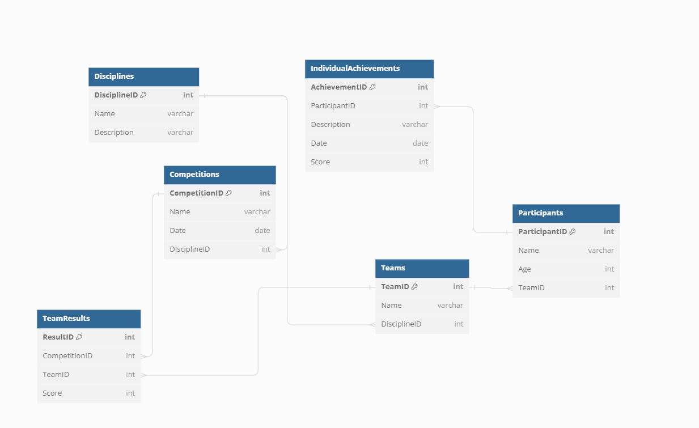

# НИЯУ МИФИ. ИИКС. Лабораторная работа №1-1. «Построение модели данных». Фамилия Имя Б20-505. 2023.
## Обзор предметной области

Рассматриваемая предметная область - организация соревнований. Включены важные компоненты, такие как дисциплины, команды, участники, их достижения, а также проводимые соревнования.

## Диаграмма сущностей

## Спецификация таблиц

### Disciplines

| Название Поля   | Тип                        | Описание                          | Первичный ключ? | Внешний ключ? |
|-----------------|----------------------------|----------------------------------|-----------------|---------------|
| DisciplineID    | Unique Identifier          | ID дисциплины                     | Да              | Нет           |
| Name            | Text                       | Название дисциплины               | Нет             | Нет           |
| Description     | Text                       | Описание дисциплины               | Нет             | Нет           |

### Teams

| Название Поля   | Тип                        | Описание                          | Первичный ключ? | Внешний ключ?             |
|-----------------|----------------------------|----------------------------------|-----------------|---------------------------|
| TeamID          | Unique Identifier          | ID команды                        | Да              | Нет                       |
| Name            | Text                       | Название команды                  | Нет             | Нет                       |
| DisciplineID    | Foreign Key to Disciplines | ID дисциплины                     | Нет             | Да (Disciplines.DisciplineID) |

### Participants

| Название Поля   | Тип                        | Описание                          | Первичный ключ? | Внешний ключ?         |
|-----------------|----------------------------|----------------------------------|-----------------|-----------------------|
| ParticipantID   | Unique Identifier          | ID участника                      | Да              | Нет                   |
| Name            | Text                       | Имя участника                     | Нет             | Нет                   |
| Age             | Int                        | Возраст участника                 | Нет             | Нет                   |
| TeamID          | Foreign Key to Teams       | ID команды                        | Нет             | Да (Teams.TeamID)      |

### Competitions

| Название Поля   | Тип                        | Описание                          | Первичный ключ? | Внешний ключ?                 |
|-----------------|----------------------------|----------------------------------|-----------------|---------------------------|
| CompetitionID   | Unique Identifier          | ID соревнования                   | Да              | Нет                       |
| Name            | Text                       | Название соревнования             | Нет             | Нет                       |
| Date            | Date                       | Дата соревнования                 | Нет             | Нет                       |
| DisciplineID    | Foreign Key to Disciplines | ID дисциплины                     | Нет             | Да (Disciplines.DisciplineID) |

### TeamResults

| Название Поля   | Тип                        | Описание                          | Первичный ключ? | Внешний ключ?                 |
|-----------------|----------------------------|----------------------------------|-----------------|---------------------------|
| ResultID        | Unique Identifier          | ID результата                     | Да              | Нет                       |
| CompetitionID   | Foreign Key to Competitions| ID соревнования                   | Нет             | Да (Competitions.CompetitionID)|
| TeamID          | Foreign Key to Teams       | ID команды                        | Нет             | Да (Teams.TeamID)          |
| Score           | Int                        | Оценка                           | Нет             | Нет                       |

### IndividualAchievements

| Название Поля   | Тип                        | Описание                          | Первичный ключ? | Внешний ключ?                     |
|-----------------|----------------------------|----------------------------------|-----------------|---------------------------|
| AchievementID   | Unique Identifier          | ID достижения                     | Да              | Нет                       |
| ParticipantID   | Foreign Key to Participants| ID участника                      | Нет             | Да (Participants.ParticipantID)|
| Description     | Text                       | Описание                          | Нет             | Нет                       |
| Date            | Date                       | Дата достижения                   | Нет             | Нет                       |
| Score           | Int                        | Оценка                           | Нет             | Нет                       |

## Приложение
[SQL сценарий для создания таблиц в SQLite](./organization.sql)

## Доказательство 3 нормальной формы
### 1NF (Первая нормальная форма)

**Определение**: Таблица находится в 1NF, если она удовлетворяет следующим условиям:
1. Все столбцы содержат только атомарные (неделимые) значения.
2. Значения в каждом столбце одного и того же типа.
3. У всех записей есть уникальный идентификатор.

**Доказательство**: Все таблицы удовлетворяют условиям 1NF. У каждой записи есть уникальный идентификатор, такой как `DisciplineID`, `TeamID` и т. д. Каждый столбец имеет значения одного и того же типа, и все значения являются атомарными.

### 2NF (Вторая нормальная форма)

**Определение**: Таблица находится в 2NF, если она:
1. Уже в 1NF.
2. Все неключевые атрибуты (столбцы) функционально зависят только от первичного ключа.

**Доказательство**: Все таблицы также соответствуют 2NF. Например, в таблице `Teams`, неключевой атрибут `Name` зависит только от `TeamID` и не зависит от других столбцов или комбинаций столбцов.

### 3NF (Третья нормальная форма)

**Определение**: Таблица находится в 3NF, если она:
1. Уже в 2NF.
2. Неключевые атрибуты не зависят от других неключевых атрибутов.

**Доказательство**: Все таблицы соответствуют 3NF. Например, в таблице `Participants`, ни один из неключевых атрибутов (таких как `Name` или `Age`) не зависит от других неключевых атрибутов.

Таким образом, структура данных нормализована до третьей нормальной формы.

## Заключение

Была разработана структура базы данных для организации соревнований. Включены сущности, отражающие дисциплины, команды, участников и их результаты. Модель оптимизирована до третьей нормальной формы, гарантируя эффективное хранение данных без избыточности. Эта структура готова поддерживать успешное проведение соревнований различных дисциплин.
