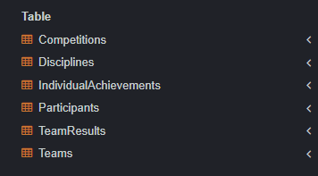

# НИЯУ МИФИ. ИИКС. Лабораторная работа №1-2. «Работа с данными. Простые запросы на выборку». Фамилия Имя, Б20-505. 2023.

### Создание и заполнение таблиц
   Был выполнен [SQL сценарий для создания таблиц в SQLite](./organization.sql). 

   Результат: создания таблицы 
  
  Созданы тестовые записи в таблице. 
  ```
-- Добавляем дисциплины
INSERT INTO Disciplines (Name, Description) VALUES ('Football', 'A team sport played with a spherical ball.');
INSERT INTO Disciplines (Name, Description) VALUES ('Basketball', 'A team sport played with a round ball and a hoop.');

-- Добавляем команды
INSERT INTO Teams (Name, DisciplineID) VALUES ('Team A', 1);
INSERT INTO Teams (Name, DisciplineID) VALUES ('Team B', 1);
INSERT INTO Teams (Name, DisciplineID) VALUES ('Team C', 2);
INSERT INTO Teams (Name, DisciplineID) VALUES ('Team D', 2);

-- Добавляем участников
INSERT INTO Participants (Name, Age, TeamID) VALUES ('John Doe', 25, 1);
INSERT INTO Participants (Name, Age, TeamID) VALUES ('Jane Smith', 24, 1);
INSERT INTO Participants (Name, Age, TeamID) VALUES ('Alice Johnson', 23, 2);
INSERT INTO Participants (Name, Age, TeamID) VALUES ('Bob Brown', 22, 2);
INSERT INTO Participants (Name, Age, TeamID) VALUES ('Charlie White', 21, 3);
INSERT INTO Participants (Name, Age, TeamID) VALUES ('David Black', 20, 3);
INSERT INTO Participants (Name, Age, TeamID) VALUES ('Eve Green', 19, 4);
INSERT INTO Participants (Name, Age, TeamID) VALUES ('Frank Blue', 18, 4);

-- Добавляем соревнования
INSERT INTO Competitions (Name, Date, DisciplineID) VALUES ('Football Championship', '2023-09-15', 1);
INSERT INTO Competitions (Name, Date, DisciplineID) VALUES ('Basketball Tournament', '2023-09-16', 2);

-- Добавляем результаты команд
INSERT INTO TeamResults (CompetitionID, TeamID, Score) VALUES (1, 1, 3);
INSERT INTO TeamResults (CompetitionID, TeamID, Score) VALUES (1, 2, 2);
INSERT INTO TeamResults (CompetitionID, TeamID, Score) VALUES (2, 3, 100);
INSERT INTO TeamResults (CompetitionID, TeamID, Score) VALUES (2, 4, 98);

-- Добавляем индивидуальные достижения
INSERT INTO IndividualAchievements (ParticipantID, Description, Date, Score) VALUES (1, 'Scored a goal', '2023-09-15', 1);
INSERT INTO IndividualAchievements (ParticipantID, Description, Date, Score) VALUES (2, 'Assisted a goal', '2023-09-15', 1);
INSERT INTO IndividualAchievements (ParticipantID, Description, Date, Score) VALUES (3, 'Scored a basket', '2023-09-16', 2);
INSERT INTO IndividualAchievements (ParticipantID, Description, Date, Score) VALUES (4, 'Blocked a shot', '2023-09-16', 1);

  ```
### Простые запросы на выборку

1. **Выбрать всех участников из команды "Team A":**
```sql
SELECT Name, Age FROM Participants WHERE TeamID = (SELECT TeamID FROM Teams WHERE Name = 'Team A');
```


2. **Выбрать все команды, участвующие в "Football Championship":**
```sql
SELECT T.Name FROM Teams T
JOIN TeamResults TR ON T.TeamID = TR.TeamID
JOIN Competitions C ON TR.CompetitionID = C.CompetitionID
WHERE C.Name = 'Football Championship';
```


3. **Выбрать все дисциплины, в которых участвует "John Doe":**
```sql
SELECT D.Name FROM Disciplines D
JOIN Teams T ON D.DisciplineID = T.DisciplineID
JOIN Participants P ON T.TeamID = P.TeamID
WHERE P.Name = 'John Doe';
```


4. **Выбрать соревнования, проведенные после 1 сентября 2023 года:**
```sql
SELECT Name, Date FROM Competitions WHERE Date > '2023-09-01';
```


5. **Выбрать команды без описания дисциплины:**
```sql
SELECT T.Name FROM Teams T
JOIN Disciplines D ON T.DisciplineID = D.DisciplineID
WHERE D.Description IS NULL;
```


6. **Выбрать участников младше 21 года:**
```sql
SELECT Name, Age FROM Participants WHERE Age < 21;
```


7. **Выбрать средний возраст участников каждой команды:**
```sql
SELECT T.Name, AVG(P.Age) AS AverageAge FROM Participants P
JOIN Teams T ON P.TeamID = T.TeamID
GROUP BY T.Name;
```


8. **Выбрать команды, которые забили более 50 очков в соревнованиях:**
```sql
SELECT T.Name FROM Teams T
JOIN TeamResults TR ON T.TeamID = TR.TeamID
WHERE TR.Score > 50;
```


9. **Выбрать дисциплины, в которых нет соревнований:**
```sql
SELECT D.Name FROM Disciplines D
LEFT JOIN Competitions C ON D.DisciplineID = C.DisciplineID
WHERE C.CompetitionID IS NULL;
```


10. **Выбрать участников, которые не имеют индивидуальных достижений:**
```sql
SELECT P.Name FROM Participants P
LEFT JOIN IndividualAchievements IA ON P.ParticipantID = IA.ParticipantID
WHERE IA.AchievementID IS NULL;
```


## Заключение
База данных была заполнена тестовыми данными. На этих данных были выполнены простые запросы на выборку, которые могут понадобиться при работе данной организации.
