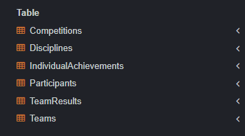
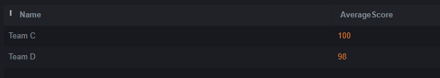
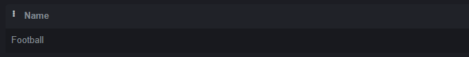
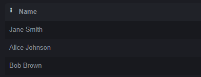
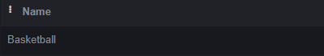
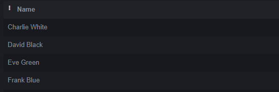
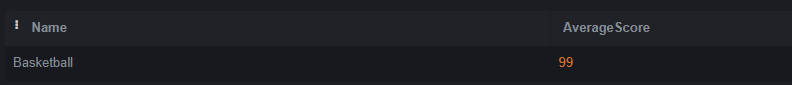
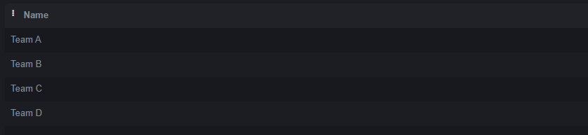

# НИЯУ МИФИ. ИИКС. Лабораторная работа №1-3. «Сложные запросы на выборку. Соединения». Фамилия Имя, Б20-505. 2023.

### Создание и заполнение таблиц
   Был выполнен [SQL сценарий для создания таблиц в SQLite](./organization.sql). 

   Результат: создания таблицы 
  
  Созданы тестовые записи в таблице. 
  ```
  -- Добавляем дисциплины
INSERT INTO Disciplines (Name, Description) VALUES ('Football', 'A team sport played with a spherical ball.');
INSERT INTO Disciplines (Name, Description) VALUES ('Basketball', 'A team sport played with a round ball and a hoop.');

-- Добавляем команды
INSERT INTO Teams (Name, DisciplineID) VALUES ('Team A', 1);
INSERT INTO Teams (Name, DisciplineID) VALUES ('Team B', 1);
INSERT INTO Teams (Name, DisciplineID) VALUES ('Team C', 2);
INSERT INTO Teams (Name, DisciplineID) VALUES ('Team D', 2);

-- Добавляем участников
INSERT INTO Participants (Name, Age, TeamID) VALUES ('John Doe', 25, 1);
INSERT INTO Participants (Name, Age, TeamID) VALUES ('Jane Smith', 24, 1);
INSERT INTO Participants (Name, Age, TeamID) VALUES ('Alice Johnson', 23, 2);
INSERT INTO Participants (Name, Age, TeamID) VALUES ('Bob Brown', 22, 2);
INSERT INTO Participants (Name, Age, TeamID) VALUES ('Charlie White', 21, 3);
INSERT INTO Participants (Name, Age, TeamID) VALUES ('David Black', 20, 3);
INSERT INTO Participants (Name, Age, TeamID) VALUES ('Eve Green', 19, 4);
INSERT INTO Participants (Name, Age, TeamID) VALUES ('Frank Blue', 18, 4);

-- Добавляем соревнования
INSERT INTO Competitions (Name, Date, DisciplineID) VALUES ('Football Championship', '2023-09-15', 1);
INSERT INTO Competitions (Name, Date, DisciplineID) VALUES ('Basketball Tournament', '2023-09-16', 2);

-- Добавляем результаты команд
INSERT INTO TeamResults (CompetitionID, TeamID, Score) VALUES (1, 1, 3);
INSERT INTO TeamResults (CompetitionID, TeamID, Score) VALUES (1, 2, 2);
INSERT INTO TeamResults (CompetitionID, TeamID, Score) VALUES (2, 3, 100);
INSERT INTO TeamResults (CompetitionID, TeamID, Score) VALUES (2, 4, 98);

-- Добавляем индивидуальные достижения
INSERT INTO IndividualAchievements (ParticipantID, Description, Date, Score) VALUES (1, 'Scored a goal', '2023-09-15', 1);
INSERT INTO IndividualAchievements (ParticipantID, Description, Date, Score) VALUES (2, 'Assisted a goal', '2023-09-15', 1);
INSERT INTO IndividualAchievements (ParticipantID, Description, Date, Score) VALUES (3, 'Scored a basket', '2023-09-16', 2);
INSERT INTO IndividualAchievements (ParticipantID, Description, Date, Score) VALUES (4, 'Blocked a shot', '2023-09-16', 1);


  ```
### Сложные запросы на выборку

1. **Выбрать команды, у которых средний балл выше среднего балла всех команд в соревнованиях:**
```sql
SELECT T.Name, AVG(TR.Score) AS AverageScore
FROM Teams T
JOIN TeamResults TR ON T.TeamID = TR.TeamID
GROUP BY T.Name
HAVING AVG(TR.Score) > (SELECT AVG(Score) FROM TeamResults);
```



2. **Выбрать дисциплины, в которых участвует "John Doe":**
```sql
SELECT DISTINCT D.Name
FROM Disciplines D
JOIN Teams T ON D.DisciplineID = T.DisciplineID
JOIN Participants P ON T.TeamID = P.TeamID
WHERE P.Name = 'John Doe';
```




3. **Выбрать участников, которые участвовали в том же соревновании, что и "John Doe":**
```sql
SELECT DISTINCT P2.Name
FROM Participants P1
JOIN Teams T1 ON P1.TeamID = T1.TeamID
JOIN TeamResults TR1 ON T1.TeamID = TR1.TeamID
JOIN TeamResults TR2 ON TR1.CompetitionID = TR2.CompetitionID
JOIN Teams T2 ON TR2.TeamID = T2.TeamID
JOIN Participants P2 ON T2.TeamID = P2.TeamID
WHERE P1.Name = 'John Doe' AND P2.Name <> 'John Doe';
```




4. **Выбрать дисциплины, в которых команда "Team A" не участвует:**
```sql
SELECT D.Name
FROM Disciplines D
WHERE D.DisciplineID NOT IN (SELECT DisciplineID FROM Teams WHERE Name = 'Team A');
```




5. **Выбрать участников, которые не имеют индивидуальных достижений, но их команды забили более 50 очков:**
```sql
SELECT P.Name
FROM Participants P
JOIN Teams T ON P.TeamID = T.TeamID
JOIN TeamResults TR ON T.TeamID = TR.TeamID
WHERE TR.Score > 50 AND P.ParticipantID NOT IN (SELECT ParticipantID FROM IndividualAchievements);
```




6. **Выбрать дисциплины, в которых средний балл команд выше 40:**
```sql
SELECT D.Name, AVG(TR.Score) AS AverageScore
FROM Disciplines D
JOIN Teams T ON D.DisciplineID = T.DisciplineID
JOIN TeamResults TR ON T.TeamID = TR.TeamID
GROUP BY D.Name
HAVING AVG(TR.Score) > 40;
```




7. **Выбрать команды, которые участвовали во всех соревнованиях своей дисциплины:**
```sql
SELECT T.Name
FROM Teams T
WHERE NOT EXISTS (
    SELECT C.CompetitionID
    FROM Competitions C
    WHERE C.DisciplineID = T.DisciplineID AND C.CompetitionID NOT IN (
        SELECT TR.CompetitionID
        FROM TeamResults TR
        WHERE TR.TeamID = T.TeamID
    )
);
```




## Заключение
База данных была заполнена тестовыми данными. На этих данных были выполнены сложные запросы на выборку, которые могут понадобиться при работе данной организации.

